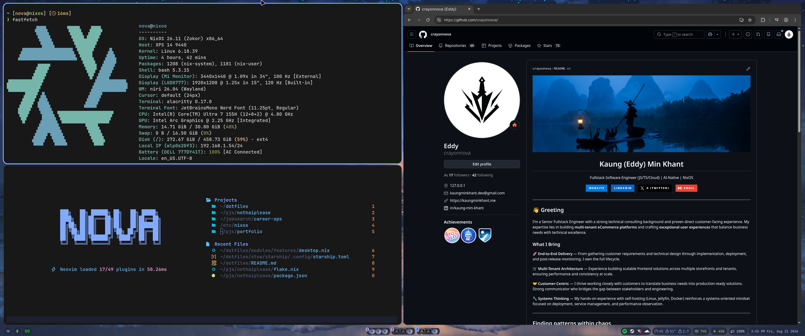

# dotfiles

Personal dotfiles repo built around Nix flakes and Home Manager.



It captures my daily personal and development setup across multiple users and machines, with flake-pinned inputs for reproducible Linux environments, especially NixOS. Desktop setups are centered on Wayland with Niri, while most application configs still live under `stow/` so they can be linked by Home Manager or used manually with GNU Stow when needed.

[](https://codespaces.new/crayonnova/dotfiles/tree/codespaces)

## Repository structure

```text
dotfiles/
├── flake.nix                    # Flake entrypoint; defines Home Manager targets and composes shared, user, and profile modules.
├── flake.lock                   # Locked upstream inputs such as nixpkgs, home-manager, niri, noctalia, and lightpanda.
├── home.nix                     # Shared Home Manager base; defines `myconfig` options and imports repo modules.
├── CLAUDE.md                    # Agent-facing map of the repo.
├── README.md                    # Top-level repo guide.
│
├── modules/                     # Reusable Home Manager modules grouped by concern.
│   ├── base/
│   │   ├── packages.nix         # Base packages, per-feature optionals, pointer cursor theme.
│   │   ├── shell.nix            # Bash, starship, atuin, zoxide, direnv, carapace, eza, aliases, helper shell functions.
│   │   └── cli-tools.nix        # ripgrep, bat, tmux; npm user-config redirect.
│   ├── features/
│   │   ├── dev-tools.nix        # Neovim, zed, git/gh/gh-dash/lazygit, bun, fabric-ai, dbeaver, lightpanda service.
│   │   ├── desktop.nix          # WezTerm, GTK icon theme, browsers, opencode/claude-code, optional end-user apps.
│   │   ├── fonts.nix            # fontconfig default families.
│   │   └── noctalia.nix         # Noctalia shell homeModule + config symlink.
│   ├── system/
│   │   └── codespace.nix        # Codespaces-specific overrides.
│   └── wayland/
│       ├── default.nix          # niri-flake homeModule import + niri config symlink.
│       └── packages.nix         # Terminals, fuzzel, clipboard (wl-clipboard/cliphist), normcap OCR.
│
├── profiles/                    # Feature presets: desktop, cli-dev, codespace.
├── users/                       # Per-user identity modules with username and Home Manager state version.
├── stow/                        # GNU Stow-compatible dotfile source tree mirrored to home-directory paths.
│   ├── alacritty/               # Alacritty terminal config.
│   ├── bun/                     # Bun config (.bunfig.toml).
│   ├── claude-code/             # Claude Code settings.json.
│   ├── fuzzel/                  # Fuzzel launcher config.
│   ├── ghostty/                 # Ghostty terminal config.
│   ├── kitty/                   # Kitty terminal config.
│   ├── niri/                    # Niri compositor config.
│   ├── noctalia/                # Noctalia shell config.
│   ├── nvim/                    # Neovim config.
│   ├── opencode/                # OpenCode config.
│   ├── starship/                # Starship prompt config.
│   ├── tmux/                    # tmux config.
│   └── wezterm/                 # WezTerm config.
│
├── scripts/                     # Helper scripts used by shell aliases and local workflows.
│   ├── fuzzel-home-search.sh    # Fuzzel-driven home directory search.
│   ├── hm-outdated.sh           # `lpkgs` — list outdated Home Manager packages.
│   ├── listallusers.sh          # `listallusers` — enumerate system users.
│   └── nix-edit.sh              # `nedit` — jump into a Nix config file.
└── .devcontainer/               # Codespaces/devcontainer bootstrap files.
```

## Home Manager targets

| Target | User | Profile |
|---|---|---|
| `crayon@nixos` | `users/crayon.nix` | `desktop` |
| `crayon@nixie` | `users/crayon.nix` | `desktop` |
| `nova@nixos` | `users/nova.nix` | `desktop` |
| `kaungminkhant@DESKTOP-JA8S7GL` | `users/kaungminkhant.nix` | `desktop` |
| `crayon@nixoswsl` | `users/crayon.nix` | `cli-dev` |
| `vscode@codespaces` | `users/vscode.nix` | `codespace` |

All targets are `x86_64-linux`.

## Feature flags

`myconfig.features` gates every optional module.

| Flag | Enables |
|---|---|
| `devtools` | Neovim + LSPs, zed, git/gh/lazygit, bun, ollama, awscli2, cloudflared, lightpanda |
| `desktop` | Niri/Wayland, terminals, Noctalia bar, WezTerm, cursor + icon themes |
| `software` | Spotify, browsers, Obsidian, Steam, Discord/Vesktop, OpenCode, Claude Code, media apps |
| `fonts` | JetBrains Mono Nerd, Cascadia Code, Inter, Noto (incl. CJK + emoji) |

- `profiles/desktop.nix` — all four `true`.
- `profiles/cli-dev.nix` — `devtools` + `fonts` only.
- `profiles/codespace.nix` — imports `cli-dev` and sets `myconfig.system.isCodespace`.

## How repo is composed

- `flake.nix` declares Home Manager outputs for each user@host target and applies the lightpanda overlay.
- `users/*.nix` provides identity-specific values such as username and state version.
- `profiles/*.nix` toggles high-level feature sets.
- `home.nix` declares the `myconfig` option tree and imports every module from `modules/`.
- Modules link config files from `stow/` with `mkOutOfStoreSymlink`, so edits under `stow/` take effect immediately without a rebuild. `stow/README.md` keeps manual GNU Stow usage available as fallback.

## Apply config

```bash
# From dotfiles root
home-manager switch --flake .#<user>@<host>
# e.g.
home-manager switch --flake .#nova@nixos

# Or with nh
nh home switch .

# Shell aliases defined in modules/base/shell.nix
hh    # home-manager switch --flake .
hhr   # switch, then log out
```

## Flake inputs

- `nixpkgs` — nixos-unstable
- `home-manager` — follows nixpkgs
- `niri` — `sodiboo/niri-flake`
- `noctalia` — `noctalia-dev/noctalia` (`legacy-v4` branch)
- `lightpanda` — headless browser + CDP server; provides an overlay and a `services.lightpanda` user service on `127.0.0.1:9222`

> **Note:** `lightpanda` is currently pinned to a local path (`path:/home/nova/lightpanda-nix`), so the flake will not evaluate on another machine until that input points at `github:crayonnova/lightpanda-nix`.

`nixpkgs` is configured with `allowUnfree = true` and `permittedInsecurePackages` for `electron-39.8.10` and `pnpm-10.29.2`.

## Notes

- Main target platform is `x86_64-linux`, with NixOS-oriented workflows and a Codespaces profile.
- Desktop path uses Wayland with Niri, plus companion tools like fuzzel, wl-clipboard, cliphist, normcap, playerctl, brightnessctl, and PipeWire patchbays (qpwgraph, helvum).
- Reproducibility comes from flake-pinned package inputs; most user-facing app configs are stored in this repo and linked into place.

Feel free to explore repo, and ping me if you want to chat about any part of it.
